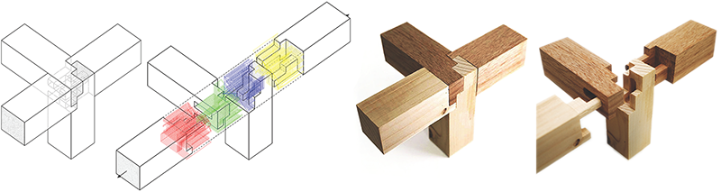

# Tsugite

NOTE: Original project is [here](https://github.com/marialarsson/tsugite).

I intend to incorporate the OpenGL library that I've built to simplify the code and make it more understandable.

## Interactive Design and Fabrication of Wood Joints



This is the repository related to a paper presented at UIST 2020.
It is an interface where you can model a joint geometry in a voxelized design space, and export milling paths for fabrication with a 3-axis CNC-machine.

This software is free for personal use and non-commercial research conducted within non-commercial organizations.
If you want to use it for commercial purposes, please contact Kaoru Shigeta (shigeta@todaitlo.jp).

### Environment
- Python 3.8.3
- pip 21.1.2
- Packages: [requirements_win.txt](requirements_win.txt)

It is recommended to use a virtual environment, for example [venv](https://docs.python.org/3/library/venv.html).

The following command will install the packages at once.
```
$ pip install -r requirements.txt
```

### Run Program
After installing the necessary packages, run the application by the following commands.
```
$ workon tsugite
$ cd tsugite
$ python App.py
```
